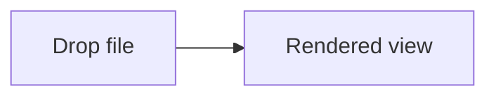

# Filemark — The Best Markdown, MDX, JSON & Schema Viewer for Chrome

> The Chrome extension you wished existed. Drop in a `.md`, `.mdx`, `.json`, `.jsonc`, `.sql`, `.prisma`, or `.dbml` file and watch it render exactly how you want — beautifully, instantly, and 100% on your machine. No cloud. No account. No tracking. No bloat.

Every existing markdown viewer for Chrome is either abandoned, buggy, Manifest V2-only, or limited to raw text with a few bullet points. Filemark is built by people who read markdown and JSON every day — and got tired of every alternative.

This is the file reader Chrome should have shipped with.

---

## Table of contents

- [Why Filemark](#why-filemark)
- [What you can open](#what-you-can-open)
- [Features that other viewers can't touch](#features-that-other-viewers-cant-touch)
- [Install](#install)
- [Usage](#usage)
- [Custom components in markdown](#custom-components-in-markdown)
- [Keyboard shortcuts](#keyboard-shortcuts)
- [Options & customization](#options--customization)
- [How Filemark compares](#how-filemark-compares)
- [Build from source](#build-from-source)
- [Frequently asked questions](#frequently-asked-questions)
- [Roadmap](#roadmap)

---

## Why Filemark

Every markdown extension in the Chrome Web Store is stuck in 2018. Most of them:

- Can't render tables properly
- Silently drop task lists, math, or code blocks
- Have no search, no tabs, no library — every file is a one-off drag
- Haven't been updated since Manifest V2 (and will stop working soon)
- Bundle ads and trackers
- Break on anything that isn't `README.md`

Filemark was built because reading beautifully formatted documents locally should be a solved problem. It renders every edge case correctly, treats your files as a library instead of disposable drops, and ships a design that stays out of your way.

## What you can open

One extension. Seven formats. Every format with its own first-class renderer — not a fallback to highlighted text.

| Format | Extensions | What you get |
| --- | --- | --- |
| **Markdown** | `.md`, `.markdown` | Full GitHub-flavored rendering — tables, task lists, math, syntax-highlighted code, Mermaid diagrams, callouts, tabs, collapsibles, a table of contents, and persistent task checkboxes |
| **MDX** | `.mdx` | Markdown plus HTML-style components — Callouts, Tabs, Details, database diagrams — without any JavaScript evaluation trickery |
| **JSON** | `.json` | A real, interactive tree viewer — not a prettified blob. Collapse, expand, click-to-copy, nine themes, handles multi-megabyte files |
| **JSONC** | `.jsonc` | Like JSON but with comments and trailing commas. Parse errors pinpointed to the line and column |
| **SQL** | `.sql` | Drop any Postgres, MySQL, SQLite, Supabase, CockroachDB, ClickHouse, BigQuery, Snowflake, or MariaDB schema — get an interactive ER diagram |
| **Prisma** | `.prisma` | Your Prisma schema, rendered as a live ER diagram. Models, enums, relations, indexes — all visible at a glance |
| **DBML** | `.dbml` | The clean schema DSL from dbdiagram.io — now right in your browser |

Every file can also be viewed in a syntax-highlighted raw source mode (toggle with **R**) with soft-wrap and one-click copy.

## Features that other viewers can't touch

### Rendering that actually works

- **Real GitHub-flavored markdown** — tables, task lists, strikethrough, autolinks, footnotes, and everything else you'd expect on GitHub.com
- **Math** — both inline (`$E=mc^2$`) and block (`$$…$$`), with a typesetter that's as good as academic papers
- **Mermaid diagrams** — flowcharts, sequences, state machines, class diagrams, gantt charts, pies, mindmaps. With pan, zoom, and fullscreen
- **Interactive database schema diagrams** — drop a SQL or Prisma file, get a zoomable ER diagram you can actually read
- **Syntax-highlighted code blocks** — thirty-plus languages with a theme that matches the rest of the UI
- **Custom components** — Callouts (five variants), Tabs, Collapsible details — all usable in your markdown with simple HTML-like syntax
- **YAML frontmatter** — rendered as a compact metadata card, not shown as raw text in the body
- **Task-list checkboxes that actually toggle and persist** — tick a box, reload, it's still ticked

### A real library, not just a file dropper

- **Drag & drop anything** — one file, ten files, a whole folder with thousands of files, a folder dragged from Finder or Explorer
- **Open Folder** — pick a directory and Filemark walks it, builds a tree, and remembers permission so it auto-reconnects on reload
- **Tabs** — open multiple files, flip between them, reorder. Each tab has a stable URL you can share
- **Full-text search** — hit <kbd>⌘K</kbd>, find any string across every loaded file in under 100 ms
- **Per-folder filter** — every folder in the sidebar has its own inline filter so you can drill into 500-file folders without losing your place
- **Star & recents** — pin the files you live in. Recents keep their order so muscle memory works
- **Live file editing** — turn on auto-refresh and the rendered view updates every two seconds as you edit the file in your editor

### UI that respects your screen

- **Three themes** — light (default), dark, sepia — plus typography controls: serif vs. sans vs. mono, font size, line height, content width
- **Distraction-free fullscreen** — one keypress hides the sidebar and tab bar
- **Deep-linkable headings** — click any Table of Contents entry, grab the URL, and it reopens right there on the same line
- **Copy-pasteable state** — every open file has a URL. Paste it in Slack; the recipient opens the exact same view

### Privacy and performance you can audit

- **Your files never leave your machine** — there is no server. No telemetry. No analytics pixel. Not even a phone-home for updates
- **Local-first by default** — everything lives in your browser's own storage; settings sync through Chrome's own secure sync if you're signed in
- **Manifest V3-native** — built for Chrome's current extension platform, not the one that's being deprecated
- **Hardened against strict CSP** — honors the strictest content security policy Chrome enforces; no `unsafe-eval`, no remote scripts
- **Fast cold-start** — the viewer is open before other extensions finish loading

### Built to be configured, not to annoy

- **Options page** with sensible defaults and every knob exposed: theme, indent, collapse depth, font, shortcuts
- **Per-format disable** — don't want Filemark handling your `.json` files? Flip a toggle, Chrome's default kicks back in
- **Per-shortcut disable** — every keyboard shortcut individually togglable, plus a master off
- **Reset to defaults** — one click, no reinstall

## Install

### From source (today)

Filemark is heading to the Chrome Web Store. Until then, loading it as an
unpacked extension takes 30 seconds:

1. Clone and build

   ```bash
   git clone https://github.com/thesatellite-ai/filemark.git
   cd filemark
   pnpm install
   pnpm build
   ```

2. Open [`chrome://extensions`](chrome://extensions)

3. Toggle **Developer mode** on (top-right corner)

4. Click **Load unpacked** and select the folder **`apps/chrome-ext/dist`**

5. The Filemark icon appears in your toolbar. Click it — you're in.

### Enable `file://` auto-render (strongly recommended)

To make Filemark take over when you navigate straight to a local file:

1. On [`chrome://extensions`](chrome://extensions), click **Details** on Filemark
2. Flip on **Allow access to file URLs**
3. Visit `file:///Users/you/notes/README.md` — it renders automatically, and the URL becomes shareable

## Usage

Three ways to open a file. Pick whichever fits your habits.

### 1. Visit a `file://` URL

Paste or click any `file:///path/to/something.md`. Filemark intercepts it, renders beautifully, and rewrites the URL into a copyable, shareable form. The fastest path for documentation you keep bookmarked.

### 2. Drag & drop

Drop one file, many files, or a whole folder from Finder / Explorer onto the viewer. Filemark reads the folder's real absolute path automatically — so features like "Open in VS Code" and "Reveal in Finder" light up without you configuring anything.

### 3. Open Folder

Click **Open Folder** in the top-right. Pick a directory. Filemark walks it, collects every supported file, and keeps the folder remembered across browser restarts.

## Custom components in markdown

Rich components, in plain markdown, with zero build step on your end.

### Callouts (five variants)

```md
<Callout type="tip" title="Pro tip">

Use <kbd>⌘K</kbd> to search across every open file.

</Callout>
```

Types: `note`, `tip`, `info`, `warning`, `danger`. Leave blank lines inside the
component so markdown inside still renders.

### Tabs

```md
<Tabs>
  <Tab label="npm">

    npm install filemark

  </Tab>
  <Tab label="pnpm">

    pnpm add filemark

  </Tab>
</Tabs>
```

### Collapsible details

```md
<Details summary="Click to expand">

Hidden content goes here. Markdown inside works with blank lines.

</Details>
```

### Diagrams, inline

Fence a block with ` ```mermaid `:

````md

````

Or fence a schema with ` ```schema `, ` ```prisma `, or ` ```dbml ` and get an interactive ER diagram in the middle of your docs.

### YAML frontmatter

```md
---
title: My Document
description: A short summary
tags: [getting-started, tutorial]
---

# Body content starts here
```

Renders as a compact metadata card — title, subtitle, tag pills, and a grid for everything else.

## Keyboard shortcuts

All bare keys, all gated against inputs so you can type freely in the search or filter boxes. All individually configurable on the options page.

| Action | Shortcut |
| --- | --- |
| Search | <kbd>⌘K</kbd> |
| Toggle sidebar | <kbd>⌘B</kbd> |
| Toggle Table of Contents | <kbd>\\</kbd> |
| Fullscreen viewer | <kbd>F</kbd> |
| Rendered ↔ Raw source | <kbd>R</kbd> |
| Next tab | <kbd>]</kbd> |
| Previous tab | <kbd>[</kbd> |
| Close tab | <kbd>X</kbd> |
| Jump to tab *n* | <kbd>1</kbd>–<kbd>9</kbd> |
| Focus folder filter | <kbd>/</kbd> |
| Close overlays / exit fullscreen | <kbd>Esc</kbd> |

## Options & customization

Click the gear in the top-right, or visit
[`chrome://extensions`](chrome://extensions) → Filemark → **Extension
options**. Everything syncs across your Chrome profiles automatically.

- **File formats** — enable / disable each of the seven formats individually
- **JSON viewer** — theme (nine choices), collapse depth, long-string truncation, indentation, data-type badges, size hints, clipboard icons
- **Keyboard shortcuts** — per-shortcut on/off plus a master disable
- **Appearance** — light / dark / sepia, font family, size, line height, content width

## How Filemark compares

| | Filemark | Most markdown extensions | Online viewers | Obsidian / VS Code |
| --- | :---: | :---: | :---: | :---: |
| **MV3-native** | ✅ | ⚠️ (most are MV2) | — | — |
| **GitHub-flavored markdown** | ✅ | ⚠️ partial | ✅ | ✅ |
| **MDX custom components** | ✅ | ❌ | ❌ | ⚠️ |
| **KaTeX math** | ✅ | ❌ | ⚠️ | ✅ |
| **Mermaid diagrams** | ✅ | ❌ | ⚠️ | ✅ (plugin) |
| **Interactive JSON tree** | ✅ | ❌ | ⚠️ | ❌ |
| **JSONC with comments** | ✅ | ❌ | ❌ | ⚠️ |
| **SQL / Prisma → ER diagram** | ✅ | ❌ | ❌ | ⚠️ (external tool) |
| **Tabs across files** | ✅ | ❌ | ❌ | ✅ |
| **URL-shareable state** | ✅ | ❌ | ⚠️ | ❌ |
| **Full-text search across files** | ✅ | ❌ | ❌ | ✅ |
| **100% local, no cloud** | ✅ | ⚠️ | ❌ | ✅ |
| **No account needed** | ✅ | ✅ | ❌ | ✅ |
| **Zero-friction install** | ✅ | ✅ | ✅ | ❌ |
| **Auto-refresh while you edit** | ✅ | ❌ | ❌ | ❌ |

## Build from source

Requirements: **Node 20+**, **pnpm 9+**, a recent Chrome.

```bash
git clone https://github.com/thesatellite-ai/filemark.git
cd filemark
pnpm install

# watch-rebuild while you edit
pnpm dev

# production build
pnpm build
```

The output lives in `apps/chrome-ext/dist/`. Reload the Filemark card at
[`chrome://extensions`](chrome://extensions) after each production build.

## Frequently asked questions

**Is any of my data sent anywhere?**
No. Filemark runs entirely in your browser. No server, no telemetry, no analytics. Your settings sync through Chrome's own `storage.sync`, which Google end-to-end encrypts when you have sync enabled.

**Does it work offline?**
Yes. Once installed there is zero network dependency for rendering.

**Why doesn't Filemark edit files?**
Filemark is a *reader* — optimized for showing your content at its best. An opt-in editable raw mode is planned. For editing, use your editor; for reading, use Filemark. Turn on auto-refresh and you get the best of both: edit in your editor, watch it update here live.

**Can I open really big files?**
Yes. JSON files up to 1 MB render with full expansion; above that, the tree renders collapsed for speed. Very large markdown files render fine — scroll and search both work on 500-page documents.

**Can I customize the keyboard shortcuts?**
You can turn each shortcut on or off individually. Full chord rebinding (VS Code-style) is on the roadmap.

**Will it replace VS Code / Obsidian?**
For editing, no. For *reading* local markdown and JSON, for most developers, yes — Filemark opens faster, looks better, handles schemas and JSON natively, has a real tabs + library UX, and doesn't need a separate app launch.

**What about security?**
Filemark is Manifest V3-native with the strictest content security policy Chrome enforces. It does not use `unsafe-eval`, does not run remote scripts, and does not require any permissions beyond storage. Folder access is governed by the browser's File System Access API and is revocable at any time.

**How do I trust the code?**
Filemark is open source. Read the [source](https://github.com/thesatellite-ai/filemark), audit the manifest, watch the network traffic. What you see is what you get.

**Can I use it in an air-gapped / offline environment?**
Absolutely — install it from source, unpack the build, distribute the `dist/` folder internally. No network calls are made after installation.

## Roadmap

- **Editable raw source mode** — edit files straight from the viewer with full syntax highlighting
- **Code-file renderer** — `.ts`, `.tsx`, `.js`, `.jsx`, `.py`, `.rs` and friends, with line anchors and copy-link
- **CSV / TSV viewer** — filterable, sortable, handles hundreds of thousands of rows
- **YAML / TOML renderers** — first-class structured viewers, not just syntax highlighting
- **Image viewer** — zoom, pan, pixel-peep for `.svg`, `.png`, `.jpg`, `.webp`
- **ORM schema auto-detection** — Drizzle, TypeORM, Sequelize, MikroORM, Kysely
- **Link graph / backlinks** between markdown files
- **VS Code-style keyboard rebinding** with chord capture and conflict detection
- **Full MDX with JavaScript expressions** via a sandboxed iframe
- **VS Code extension** — the same renderers inside a VS Code webview

---

<p align="center">
  <em>
    Built for people who read a lot of markdown.<br/>
    Local-first · MV3-native · The Satellite AI.
  </em>
</p>
