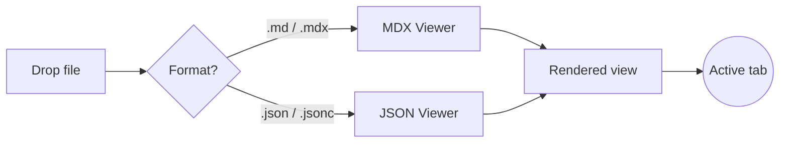
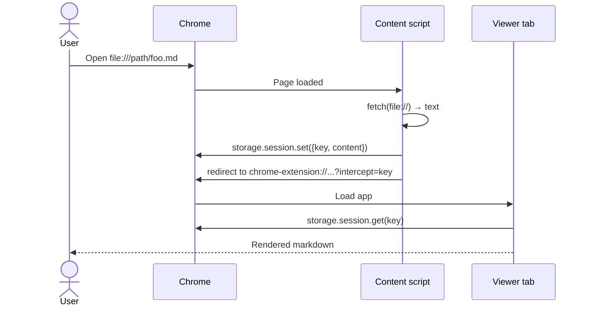
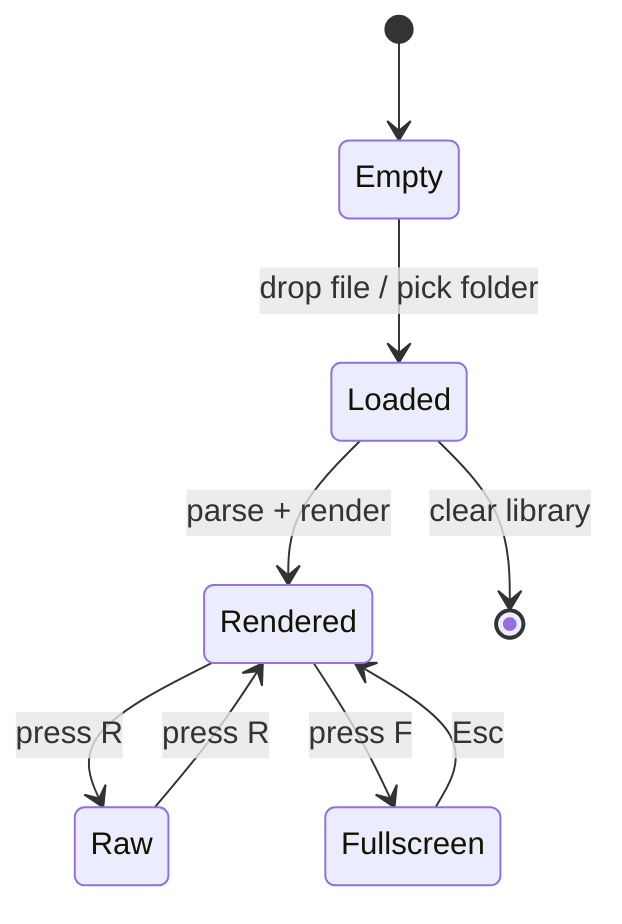
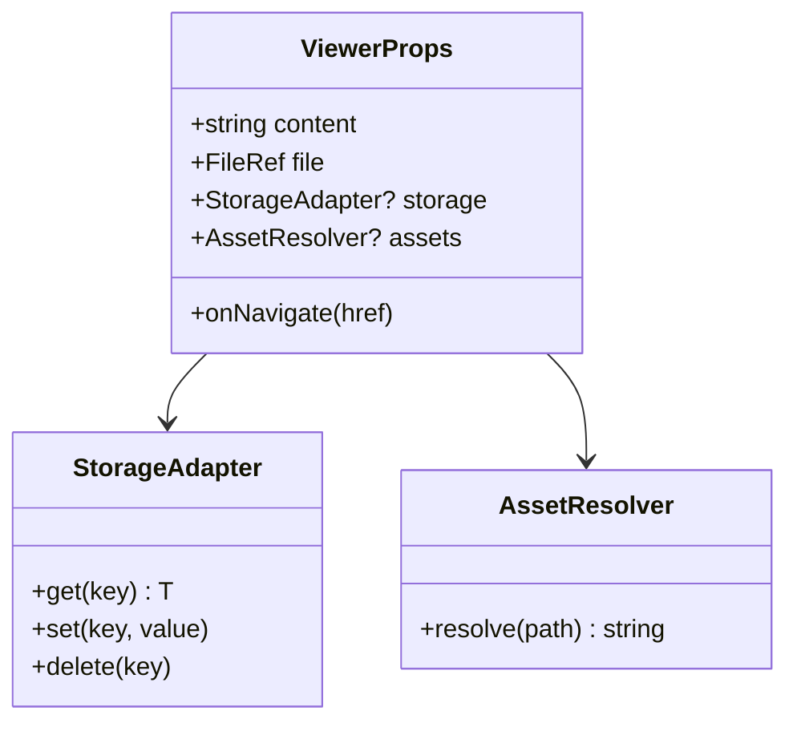
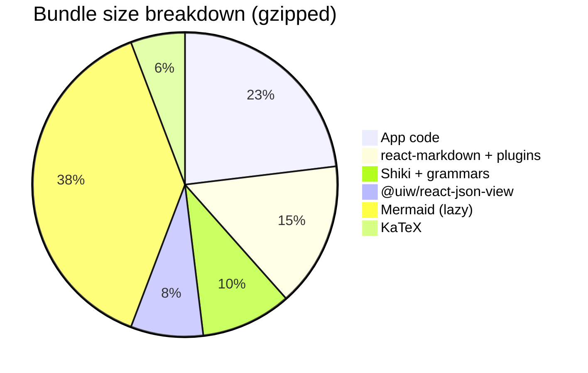
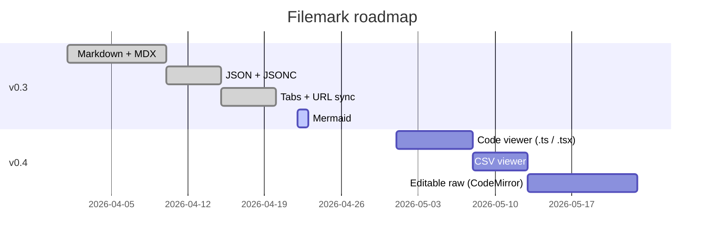
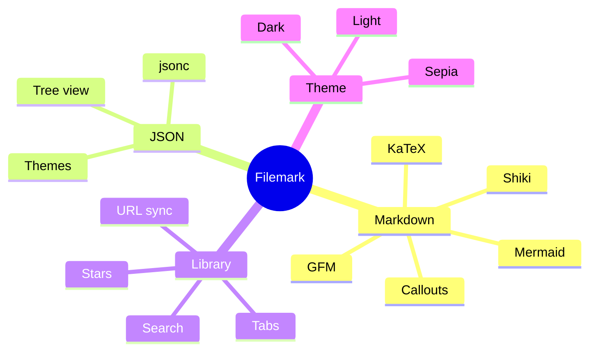

# Filemark Showcase

A single document exercising every markdown feature, GFM extension, and custom component Filemark supports. Use it as a reference or a visual smoke test when tweaking the renderer.

> **Tip.** Toggle **Raw** (<kbd>R</kbd>) to see the source side by side with how it renders.

---

## 1. Text formatting

**Bold** · *italic* · ***bold italic*** · ~~strikethrough~~ · `inline code` · <sub>subscript</sub> · <sup>superscript</sup>.

Keyboard keys render via `<kbd>`: press <kbd>⌘</kbd>+<kbd>K</kbd> to search, <kbd>F</kbd> to go full-screen.

Mark important things with `<mark>`: the <mark>most important word</mark> here.

Raw HTML passes through when you need it (thanks to `rehype-raw`):

<u>Underlined via HTML</u> · <abbr title="Hypertext Markup Language">HTML</abbr> hover-tooltips · <small>tiny text</small>.

---

## 2. Headings

# H1 — Document title
## H2 — Major section
### H3 — Subsection
#### H4 — Subsubsection
##### H5 — Rarely used
###### H6 — Barely ever

Every heading gets an auto-generated slug id (via `rehype-slug`) that lands in the Table of Contents. Click any entry in the TOC to smooth-scroll and update the URL's `#hash`.

---

## 3. Lists

### Unordered

- First item
- Second item
  - Nested once
    - Nested twice
      - Nested three deep
- Third item

### Ordered

1. Step one
2. Step two
   1. Sub-step A
   2. Sub-step B
3. Step three

### Task list (GitHub-flavored)

> Click to toggle — state persists per file across reloads.

- [x] Install Filemark
- [x] Drop a file into the viewer
- [x] Customize the theme
- [ ] Organize files into folders
- [ ] Star the ones you read often
- [ ] Set up `file://` auto-render

### Mixed / nested

- Top-level bullet
  1. Nested ordered
  2. Another numbered step
     - Bullet inside number
  3. Back to numbered
- Task under a bullet:
  - [ ] Grab lunch
  - [x] Review PR

---

## 4. Links & autolinks

- Plain inline link: [Filemark on GitHub](https://github.com)
- Reference-style link: [Shiki themes][shiki-themes]
- Autolink (GFM): https://uiwjs.github.io/react-json-view/
- Bare email (GFM): hello@example.com
- In-document anchor: jump to the [Math section](#11-math) or [Callouts](#12-callouts)

[shiki-themes]: https://shiki.style/themes

---

## 5. Images

### External image


Images from any `https://` origin load in the extension page (MV3's default
CSP doesn't restrict `img-src`).

### Inline SVG badges

  

### Data URI (always works, zero network)


### Relative images

Filemark resolves relative image paths against the directory of the
markdown file, but only when the file was opened from a folder (via
**Open Folder** or a drag-drop of the enclosing folder) or via a
`file://` URL. A pure drag-drop of a single `.md` has no sibling
directory to resolve against, so `` only renders
when you open the file that way.

Syntax (works once the sibling file exists next to this one):

```md


```

---

## 6. Blockquotes

> A single-line blockquote.

> A multi-line blockquote.
> With a second line.
>
> And a paragraph after a blank line inside the quote.

Nested quotes:

> Level one.
> > Level two.
> > > Level three.

---

## 7. Horizontal rule

Three dashes produce a rule:

---

Three asterisks or underscores work too.

---

## 8. Tables (GFM)

Basic table:

| Format | Extension | Renderer |
| ------ | --------- | -------- |
| Markdown | `.md` | `react-markdown` |
| MDX | `.mdx` | `react-markdown` + `rehype-raw` |
| JSON | `.json` | `@uiw/react-json-view` |
| JSONC | `.jsonc` | `jsonc-parser` + JSON view |

Column alignment:

| Left-aligned | Centered | Right-aligned |
| :----------- | :------: | ------------: |
| Alpha | **Bravo** | 1 |
| Charlie | Delta | 42 |
| Echo | Foxtrot | 9,001 |

A table with inline code, links, and emphasis:

| Option | Default | Description |
| --- | :---: | --- |
| `theme` | `auto` | Follows the host theme; override via [options page](#settings) |
| `collapsedDepth` | `2` | Initial JSON tree expand depth |
| `shortenTextAfterLength` | `140` | *Strings longer than this are truncated* |

---

## 9. Inline code

Wrap snippets inline: `const x = 42`, or type commands like `pnpm install`. Longer inline strings get a subtle background and border so they stand out mid-sentence: `chrome-extension://<id>/src/app/index.html?file=<id>`.

Multi-line content in **single backticks** is automatically promoted to a block — so pasting an ASCII tree or flow won't collapse to one line.

---

## 10. Fenced code blocks

Fenced code blocks render with [Shiki](https://shiki.style) using the same grammars and themes as VS Code. Thirty-plus languages ship preloaded; anything else falls back to plain text.

### TypeScript

```ts
import { defineConfig } from "tsup";

export default defineConfig({
  entry: ["src/index.ts"],
  format: ["esm"],
  dts: true,
  sourcemap: true,
  clean: true,
  target: "es2022",
});
```

### TSX

```tsx
import { useEffect, useState } from "react";
import { parseJSON } from "@filemark/json";

export function Viewer({ source }: { source: string }) {
  const [parsed, setParsed] = useState<unknown>(null);
  useEffect(() => setParsed(parseJSON(source).value), [source]);
  return <pre>{JSON.stringify(parsed, null, 2)}</pre>;
}
```

### JSON

```json
{
  "name": "filemark",
  "version": "0.3.0",
  "formats": ["md", "mdx", "json", "jsonc"],
  "features": {
    "gfm": true,
    "math": true,
    "tabs": true
  }
}
```

### JSONC

```jsonc
{
  // compilerOptions for a TypeScript project
  "compilerOptions": {
    "target": "ES2022",
    "strict": true,
    "paths": {
      "@/*": ["src/*"], /* @ aliases src/ */
    },
  },
  "include": ["src"], // trailing comma is fine in jsonc
}
```

### Shell

```bash
# Build the extension + all viewer packages
pnpm install
pnpm build

# Watch rebuild for dev
pnpm dev
```

### Python

```python
from pathlib import Path

def count_markdown(root: Path) -> int:
    return sum(1 for p in root.rglob("*.md"))

if __name__ == "__main__":
    total = count_markdown(Path.cwd())
    print(f"{total} markdown files")
```

### Rust

```rust
fn main() {
    let formats = vec!["md", "mdx", "json", "jsonc"];
    for f in &formats {
        println!("supporting .{f}");
    }
}
```

### Diff

```diff
- const formats = ["md", "mdx"];
+ const formats = ["md", "mdx", "json", "jsonc"];
```

### No-language (plain text)

```
ASCII logos, flow diagrams, and prose-like code blocks
render as monospace preformatted text when no language
tag is provided.
```

---

## 11. Math

Powered by KaTeX — both inline and block form work.

Inline: the famous identity $e^{i\pi} + 1 = 0$, Pythagoras $a^2 + b^2 = c^2$, and a quick Gauss sum $\sum_{k=1}^{n} k = \frac{n(n+1)}{2}$.

Block:

$$
\int_{-\infty}^{\infty} e^{-x^2}\,dx = \sqrt{\pi}
$$

A matrix:

$$
\mathbf{A} =
\begin{pmatrix}
1 & 2 & 3 \\
4 & 5 & 6 \\
7 & 8 & 9
\end{pmatrix}
$$

Aligned equations:

$$
\begin{aligned}
f(x) &= (x + 1)^2 \\
     &= x^2 + 2x + 1
\end{aligned}
$$

---

## 12. Callouts

Five built-in variants — use blank lines around the content so markdown-in-html re-parses.

<Callout type="note" title="Note">

A plain note. Use these to highlight important context or clarify assumptions.

</Callout>

<Callout type="tip" title="Tip">

Press <kbd>⌘K</kbd> to search, <kbd>R</kbd> to switch to the raw source view, and <kbd>[</kbd> / <kbd>]</kbd> to cycle tabs.

</Callout>

<Callout type="info" title="Did you know">

Filemark stores its settings via `chrome.storage.sync` — they follow your Chrome profile across devices automatically.

</Callout>

<Callout type="warning" title="Heads up">

HTML-style components inside markdown need **blank lines** above and below the inner content, otherwise CommonMark treats the block as literal HTML and skips the markdown parser.

</Callout>

<Callout type="danger" title="Do not do this">

Never commit `.env` files, API keys, or credentials alongside your markdown. Filemark is local-first, but once it's in a git history, it's forever.

</Callout>

---

## 13. Tabs

<Tabs>
  <Tab label="npm">

  ```bash
  npm install @filemark/mdx @filemark/json
  ```

  </Tab>
  <Tab label="pnpm">

  ```bash
  pnpm add @filemark/mdx @filemark/json
  ```

  </Tab>
  <Tab label="yarn">

  ```bash
  yarn add @filemark/mdx @filemark/json
  ```

  </Tab>
  <Tab label="bun">

  ```bash
  bun add @filemark/mdx @filemark/json
  ```

  </Tab>
</Tabs>

---

## 14. Collapsible details

<Details summary="Click to reveal the full API surface">

```ts
interface ViewerProps {
  content: string;
  file: FileRef;
  storage?: StorageAdapter;
  assets?: AssetResolver;
  onNavigate?: (href: string) => void;
  trust?: "full" | "safe";
}

interface StorageAdapter {
  get<T>(key: string): Promise<T | null>;
  set<T>(key: string, value: T): Promise<void>;
  delete(key: string): Promise<void>;
}

interface AssetResolver {
  resolve(relativePath: string): Promise<string | null>;
}
```

</Details>

<Details summary="A nested details + list">

- First hidden item
- Second hidden item
  - Nested
  - Another nested
- Third hidden item

And some **formatted text** inside.

</Details>

---

## 15. Keyboard shortcut cheat sheet

| Action | Chord |
| --- | --- |
| Open search | <kbd>⌘</kbd>+<kbd>K</kbd> |
| Toggle sidebar | <kbd>⌘</kbd>+<kbd>B</kbd> |
| Toggle Table of Contents | <kbd>\\</kbd> |
| Full-screen viewer | <kbd>F</kbd> |
| Rendered ↔ Raw source | <kbd>R</kbd> |
| Next tab | <kbd>]</kbd> |
| Previous tab | <kbd>[</kbd> |
| Close tab | <kbd>X</kbd> |
| Jump to tab *n* | <kbd>1</kbd>–<kbd>9</kbd> |
| Focus folder filter | <kbd>/</kbd> |
| Close overlays / exit full-screen | <kbd>Esc</kbd> |

---

## 16. ASCII & flow diagrams

Soft line breaks are preserved (via `remark-breaks`) so trees and flow
sketches render faithfully without needing a fenced code block.

Directory tree:

/Volumes/D/www/projects/
├── private-repo/
│   ├── codeskill/
│   │   └── research/         ← real files live here
│   ├── repo1/
│   │   └── research/
│   └── repo2/
│       └── research/
└── skills-ai/codeskill/
    └── research → ../../private-repo/codeskill/research   (symlink)

Pipeline flow:

source → extractFrontmatter → body
       → <Frontmatter data=… />
body → react-markdown(remark-gfm, remark-math, remark-breaks)
     → rehype-raw → rehype-slug → rehype-katex → components map

---

## 17. Mermaid diagrams

Fence a code block with `mermaid` and Filemark renders it as a
live diagram (lazy-loaded — the ~800 KB Mermaid bundle only downloads
the first time you open a file that uses one). Every diagram type
Mermaid ships works: flowcharts, sequence, state, class, ER, gantt,
pie, mindmaps, journey, timelines, git graph, sankey, etc.

### Flowchart



### Sequence diagram



### State diagram



### Class diagram



### Pie chart



### Gantt



### Mindmap



---

## 18. Database schema blocks

Fence any SQL, Prisma, or DBML schema with `schema`, `prisma`, or `dbml`
and Filemark parses it via [`db-schema-toolkit`](https://github.com/maxgfr/db-schema-viewer),
then renders it as an interactive ER diagram — same pan / zoom / fullscreen
toolbar as the Mermaid blocks.

### `schema` (auto-detected SQL)

```schema
CREATE TABLE users (
  id SERIAL PRIMARY KEY,
  email VARCHAR(255) UNIQUE NOT NULL,
  display_name VARCHAR(100)
);

CREATE TABLE posts (
  id SERIAL PRIMARY KEY,
  author_id INT NOT NULL REFERENCES users(id) ON DELETE CASCADE,
  title TEXT NOT NULL,
  body TEXT,
  published_at TIMESTAMPTZ
);

CREATE TABLE comments (
  id SERIAL PRIMARY KEY,
  post_id INT NOT NULL REFERENCES posts(id) ON DELETE CASCADE,
  author_id INT NOT NULL REFERENCES users(id),
  body TEXT NOT NULL,
  parent_id INT REFERENCES comments(id) ON DELETE CASCADE,
  created_at TIMESTAMPTZ DEFAULT NOW()
);
```

### `prisma`

```prisma
datasource db { provider = "postgresql" }

model Workspace {
  id        Int          @id @default(autoincrement())
  name      String
  slug      String       @unique
  members   Membership[]
  projects  Project[]
}

model Membership {
  id          Int        @id @default(autoincrement())
  role        String     @default("member")
  userId      Int
  workspaceId Int
  user        User       @relation(fields: [userId], references: [id])
  workspace   Workspace  @relation(fields: [workspaceId], references: [id])

  @@unique([userId, workspaceId])
}

model Project {
  id          Int       @id @default(autoincrement())
  name        String
  workspaceId Int
  workspace   Workspace @relation(fields: [workspaceId], references: [id])
  issues      Issue[]
}

model User {
  id          Int          @id @default(autoincrement())
  email       String       @unique
  memberships Membership[]
  issues      Issue[]      @relation("reporter")
}

model Issue {
  id         Int     @id @default(autoincrement())
  title      String
  projectId  Int
  reporterId Int
  project    Project @relation(fields: [projectId], references: [id])
  reporter   User    @relation(fields: [reporterId], references: [id], name: "reporter")
}
```

### `dbml`

```dbml
Table products {
  id integer [pk, increment]
  sku varchar [unique, not null]
  name varchar [not null]
  price_cents integer [not null]
  stock integer [default: 0]
}

Table orders {
  id integer [pk, increment]
  user_id integer [ref: > users.id, not null]
  status varchar [default: 'pending']
  total_cents integer [not null]
  created_at timestamp [default: `now()`]
}

Table order_items {
  id integer [pk, increment]
  order_id integer [ref: > orders.id, not null]
  product_id integer [ref: > products.id, not null]
  quantity integer [not null]
  price_cents integer [not null]
}

Table users {
  id integer [pk, increment]
  email varchar [unique, not null]
  name varchar [not null]
}
```

All three blocks above use the same parse-to-Mermaid pipeline the
standalone `.sql` / `.prisma` / `.dbml` file viewers do — so embedded
diagrams and file-level diagrams stay in lockstep.

---

## 19. Footnotes

Filemark supports GFM footnotes[^1]. They collect at the bottom of the
rendered document and link back to their usage point[^note].

[^1]: Footnotes are part of the GFM specification and are rendered as a numbered list below the body.
[^note]: You can name footnotes (`[^note]`) or number them (`[^1]`).

---

## 20. Emoji

Emoji pass through unicode-native: 🚀 📄 🧭 🗂️ ⚡ ✨ 🔍 🌙 ☀️ 🧪.

---

## 21. Escaping

Markdown special characters can be escaped with a backslash: \*not italics\*, \[not a link\], \_no emphasis\_. Backticks inside code spans need double-wrapping: `` `use backticks` `` works; here's a literal backtick: \`.

---

## 22. Long prose paragraph

Lorem ipsum dolor sit amet, consectetur adipiscing elit. Nam eget mi ut lacus tincidunt sollicitudin. Sed commodo velit dui, in pharetra lorem maximus a. In hac habitasse platea dictumst. Mauris et consequat nunc. Morbi in suscipit nibh. Integer sollicitudin augue id nisi hendrerit, vitae ultrices massa fringilla. *Phasellus* pretium, tortor ac feugiat porttitor, metus nulla consequat ligula, et dictum libero quam non diam. **Proin eget purus** a justo vehicula blandit. Cras nec vestibulum risus.

Short paragraph for spacing comparison. Gives you a sense of how the reading width and line-height settings affect readability.

---

## 23. Frontmatter (shown above)

Scroll back to the very top — the YAML between the triple-dashes is parsed into a card. Title, description, tag pills, and the rest of the fields render as a two-column grid.

Frontmatter fields this document uses:

| Key | Role |
| --- | --- |
| `title` | Rendered prominently at the top of the card |
| `description` | Subheading text under the title |
| `tags` | Pills — great for quick visual categorization |
| anything else | Key/value grid, useful for version, author, date… |

---

<Callout type="info" title="That's everything">

If a feature isn't in this file, Filemark doesn't render it yet. Open an issue or see the [roadmap](../README.md#roadmap) for what's coming.

</Callout>
